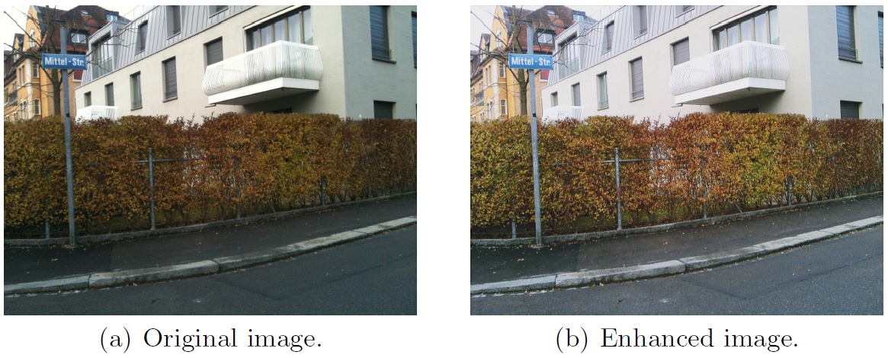

# MCRN
This is the official code of "Multiple Connected Residual Network for Image Enhancement on Smartphones", in ECCV Workshop PIRM 2018.
The test code is based on [PIRM 2018](https://github.com/aiff22/ai-challenge).

<p align="center">
  
</p>
In this figure, (a) is input image obtained by iPhone 3Gs, and (b) is enhanced image by MCRN.

### Dependencies
TensorFlow 1.8

## Testing
Please run:
```
python test/test.py
```
If you want to test your own dataset, you can replace **dped** file.

## Citation
```
@InProceedings{geometry2018pirm,
author = {Liu, Jie and Jung, Cheolkon},
title = {Multiple Connected Residual Network for Image Enhancement on Smartphones},
booktitle = {European Conference on Computer Vision Workshops},
year = {2018},
}
```
